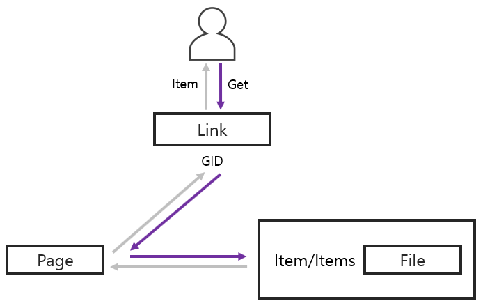

# FermesDB 
## 1. 소개
  > **FermesDB**는 Java 기반의 OOP 입니다.
## 2. 장점
  > - 객체 기반으로 Data가 저장되며, 자동 serialize/deserialize를 지원합니다.
  > - Paging 개념이 적용되어 Memory가 효율적으로 관리됩니다.
  > - Memory 사용량이 지정된 최대 사용량을 초과하지 않도록 Memory를 관리하는 기능을 지원합니다.
## 3. 사용법
### 3.1. Database 관리
Fermes Class의 정적 메소드와 Database Class의 메소드를 통해 Database를 관리할 수 있습니다.

| Class | Return | Method | Description |
| :---: | :----: | :---- | :----------- |
| Database | void | save() | 메모리 상의 Data를 실제 DB에 저장 |
| Database | void | close() | DB를 메모리 상에서 Unload |
| Fermes | Database | createDatabase(File databaseDirectory, int pageSize, int blockSize, long maxMemory)|  Database 생성 |
| Fermes | Database | loadDatabase(File databaseDirectory) | Database 불러오기 |
| Fermes | Database | loadDatabase(File databaseDirectory, long maxMemory) | Database 불러오기 및 Max Memory 설정 |
| Fermes | Database | get(new File("example_db/"), 1024, 512, Long.MAX_VALUE) | Database 존재 여부에 따라 불러오기 또는 생성
| Fermes | boolean | existDatabase(File databaseDirectory) | Database 존재 여부 확인 |
| Fermes | boolean | deleteDatabase(File databaseDirectory) | Database 삭제 |

#### 3.1.1. 생성
  ``` java
    Database databaseInstance = FermesDB.createDB(new File("example_db/"), 1024, 512, Long.MAX_VALUE);
  ```
#### 3.1.2. 불러오기
  ``` java
    Database databaseInstance = FermesDB.loadDatabase(new File("example_db/"));
                                        or
    Database databaseInstance = FermesDB.loadDatabase(new File("example_db/"), Long.MAX_VALUE);
  ```
#### 3.1.3. 생성/불러오기
  ``` java
    Database databaseInstance = FermesDB.get(new File("example_db/"), 1024, 512, Long.MAX_VALUE);
  ```
#### 3.1.4. 제거
  ``` java
    Database databaseInstance = FermesDB.deleteDB(new File("example_db/"));
  ```
### 3.2. Data 관리
  FermesDB는 Item 또는 Items를 구현/상속한 객체를 통해 Data를 관리합니다.
  > ※ 본 ReadMe에서는 Item/Items를 구현/상속한 객체를 **Data 객체**라고 정의합니다.
#### 3.2.1. 정의
  - Item  
    FermesDB에서 관리되는 단일 객체를 위한 Interface 입니다. (Ex. User)
  - Items   
    Item List를 관리하는 Manager격 객체를 위한 Abstract Class 입니다. (Ex. UserManager)
  - RootItem   
    FermesDB의 최상위 Item.
  - Link   
    매칭된 Data 객체와, 해당 객체에 대한 DB 관리 차원에서 필요한 정보를 관리하는 객체입니다.<br/>
    > ※ Link에는 매칭된 Data 객체와, 매칭된 Data 객체의 상세 정보(관계 정보, 위치 정보 등)가 저장되어 있습니다.
  - GID   
    Data 객체의 위치 정보를 나타내는 Unique ID로, 매칭된 Link에서 조회할 수 있습니다.
  - Page   
    메모리를 고정된 크기로 분할하여, 이를 가상 주소(GID)를 통해 참조하여 메모리를 효율적으로 관리합니다. 이때 고정된 크기로 분할되는 단위를 Page라고 하며, Page는 고정된 크기의 Block들로 구성되어 있습니다.
    
#### 3.2.2. 관련 메소드 요약
| Class | Modifier | Return | Method | Description |
| :---: | :------: | :---------: | :---------: | :---- |
| Database | Public | Link\<T> | getLink(String name, ItemCreator\<T> creator) | Database에 *name*과 매칭되는 Data 객체가 있을 시에는 단순 조회, 없을 시에는 *creator*를 통해 생성 후 추가 |
| Items | Public | ItemIterable\<T> | where(ItemWhere\<T> where) | Items의 Item List에서 *where*로 정의된 조건에 맞는 Item 반환 |
| Items | Protected | Link\<T> | addItem(T item) | Items의 Item List에 *item* 추가 |
| Items | Protected | boolean | removeItem(Link\<T> link) | Items의 Item List에서 *link*와 매칭된 Item을 제거 |
| Items | Protected | Link\<T> | getItemByGid(long gid) | Database에서 *gid*와 매칭된 Link 객체 반환 |
| Items | Protected | Link\<T> | getItem(int index) | Items의 ItemList[*index*]와 매칭된 Link 반환 |
| Items | Protected | Iterable<Long> | getItemGids() | Items의 Item List에 있는 Item들의 Gid 반환 |
| Items | Protected | Iterable<Link\<T>> | getItems() | Items의 Item List 반환 |
| Items | Protected | int | getItemCount() | Items의 Item List의 Count 반환 | 

#### 3.2.3. Data 참조 흐름
Data 객체를 참조할 때 아래와 같이 실행됩니다.   
- 참조하려는 Data 객체의 정보가 저장된 Page 객체를 GID를 통해 찾습니다.   
- Page 객체를 통해 Data 객체를 File로 부터 읽어드린 후 User에게 반환합니다.



#### 3.2.3. 사용법
##### 3.2.3.1. Item 추가
  ``` java
    // 선언
    public class UserManager extends Items {
      public Link<User> addUser(User item) throws LinkCreateException{
        return super.addItem(item);
      }
    }

    // 예제
    Database database = FermesDB.get(new File("example_db/"), 1024, 512, Long.MAX_VALUE);

    //만약 database에 "dummyManager"가 등록되어 있지 않다면 새로 생성 후 추가
    Link<UserManager> userManagerLink = database.getLink("userManager",() -> new UserManager());
    UserManager userManager = userManagerLink.get();

    //Item 추가
    userManager.addUser(new User());
  ```
##### 3.2.3.2. Item 조회
  ``` java
    // 선언
    public class UserManager extends Items {
      public Link<User> getUserByIndex(int index) {
        return super.getItem(index);
      }
      
      public Link<User> getUserByGid(long gid) {
        return super.getItemByGid(gid);
      }

      public Iterable<Long> getUserGids() {
        return super.getItemGids();
      }

      public Iterable<Link<User>> getUsers() {
        return super.getItems();
      }
    }

    // 예제
    Database database = FermesDB.get(new File("example_db/"), 1024, 512, Long.MAX_VALUE);

    //만약 database에 "dummyManager"가 등록되어 있지 않다면 새로 생성 후 추가
    Link<UserManager> userManagerLink = database.getLink("userManager",() -> new UserManager());
    UserManager userManager = userManagerLink.get();
  
    //0번째 User 조회
    Link<User> firsetUserLink = userManager.getUserByIndex(0);
    // 등록된 모든 User 조회
    Iterable<Link<User>> userLinks = userManager.getUsers();

    // 등록된 모든 User의 gid 조회
    for(long gid : userManager.getUserGids()){
      // gid에 매칭되는 User 조회
      Link<User> userLink = userManager.getUserByGid(gid);
    }
    // 이름이 세글자인 User들만 조회
    Iterable<Link<User>> foundUserLinks = userManager.where((user) ->{ 
      if(user.getName().length == 3) {
        return true;
      }
      return false;
    });
  ```
##### 3.2.3.3. Item 삭제
  ``` java
    // 선언
    public class UserManager extends Items {
      public boolean removeUser(Link<User> link) throws LinkCreateException{
        return super.removeItem(link);
      }
      public Link<User> getUserByIndex(int index) {
        return super.getItem(index);
      }
    }

    // 예제
    Database database = FermesDB.get(new File("example_db/"), 1024, 512, Long.MAX_VALUE);

    //만약 database에 "dummyManager"가 등록되어 있지 않다면 새로 생성 후 추가
    Link<UserManager> userManagerLink = database.getLink("userManager",() -> new UserManager());
    UserManager userManager = userManagerLink.get();
    Link<User> userLink = userManager.getUserByIndex(0);
    // userLink에 매칭되는 Item 제거
    userManager.removeUser(userLink);
  ```

